# System Architecture & Code Flow

## 🏗️ Architecture Overview

This is an **API-triggered polling system** that scrapes Facebook business pages for email addresses and updates a Google Sheet with results.

### High-Level Architecture

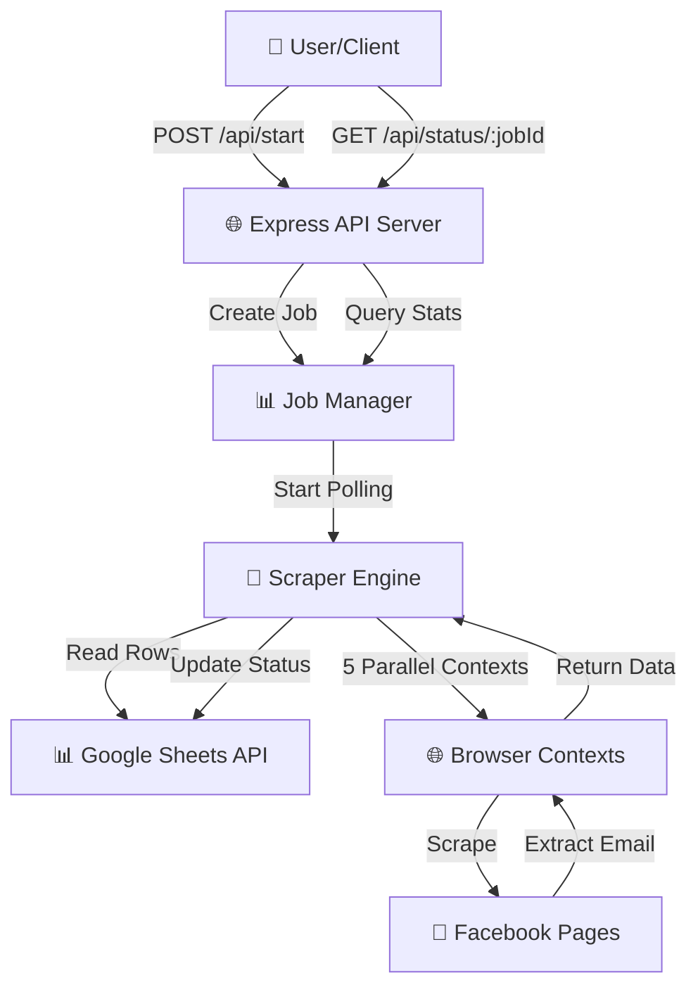

---

## 📁 File Structure & Responsibilities

### Entry Point
- **[src/index.js](file:///home/devyanshu/.gemini/antigravity/scratch/react_scraper_mvp/src/index.js)** - Application entry point
  - Loads environment variables
  - Starts Express API server
  - Sets up graceful shutdown

### API Layer
- **[src/server.js](file:///home/devyanshu/.gemini/antigravity/scratch/react_scraper_mvp/src/server.js)** - Express HTTP server
  - `POST /api/start` - Start new polling job
  - `GET /api/status/:jobId` - Get job status
  - `POST /api/stop/:jobId` - Stop running job
  - `GET /api/jobs` - List all jobs
  - `GET /health` - Health check

### Orchestration Layer
- **[src/jobManager.js](file:///home/devyanshu/.gemini/antigravity/scratch/react_scraper_mvp/src/jobManager.js)** - Job orchestration
  - Manages multiple concurrent polling jobs
  - Tracks job states and statistics
  - Handles job lifecycle (start, stop, cleanup)

### Data Layer
- **[src/sheets.js](file:///home/devyanshu/.gemini/antigravity/scratch/react_scraper_mvp/src/sheets.js)** - Google Sheets integration
  - `getPendingRows()` - Fetch rows to process
  - `updateRowStatus()` - Update row with results
  - `markAsProcessing()` - Mark row as in-progress

### Scraping Layer
- **[src/scraper.js](file:///home/devyanshu/.gemini/antigravity/scratch/react_scraper_mvp/src/scraper.js)** - Core scraping engine
  - Manages persistent browser instance
  - Handles parallel processing (5 concurrent URLs)
  - Extracts emails from Facebook pages
  - Cookie management and rotation

### Utilities
- **[src/utils.js](file:///home/devyanshu/.gemini/antigravity/scratch/react_scraper_mvp/src/utils.js)** - Logging utilities

---

## 🔄 Complete Code Flow

### Step 1: User Starts a Job

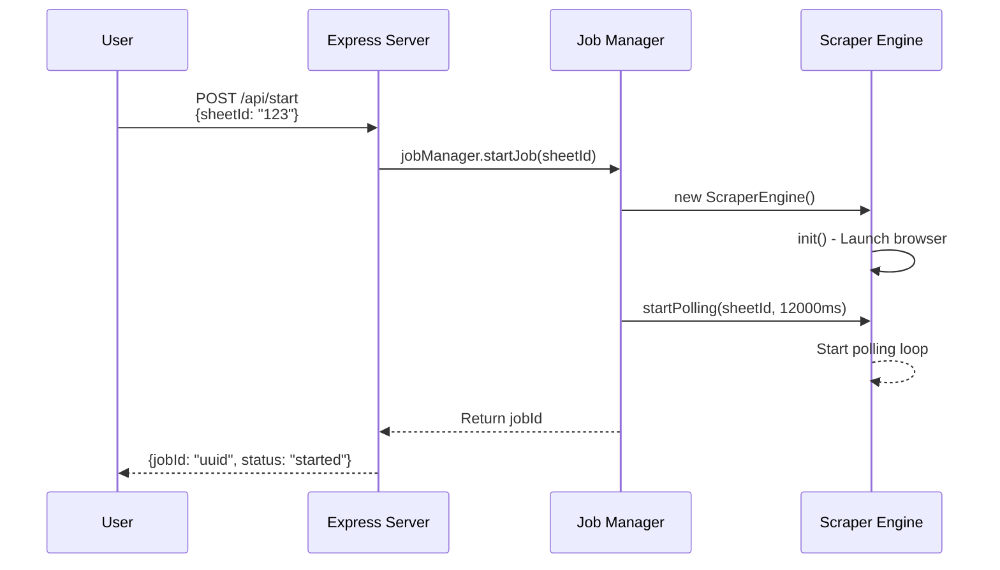

**Code Path:**
1. **index.js:6** → `startServer(port)`
2. **server.js:34** → `POST /api/start` handler
3. **jobManager.js:18** → `startJob(sheetId)`
4. **scraper.js:11** → `init()` - Launch browser
5. **jobManager.js:135** → `runPollingLoop()`
6. **scraper.js:50** → `startPolling()`

---

### Step 2: Polling Loop Begins

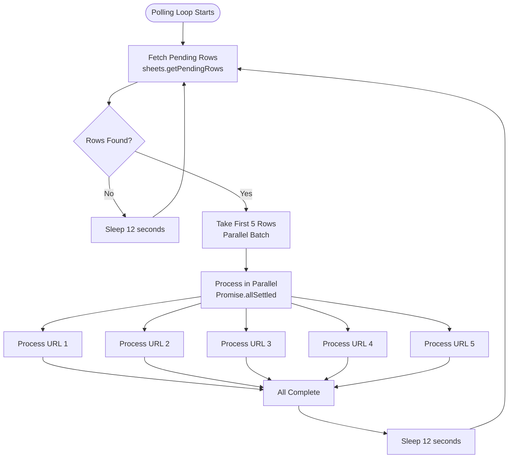

**Code Path:**
1. **scraper.js:50** → `while (this.isPolling)`
2. **scraper.js:65** → `getPendingRows(sheetId)`
3. **sheets.js:35** → Fetch rows from Google Sheets
4. **scraper.js:83** → `Promise.allSettled(batch.map(...))`
5. **scraper.js:84** → `processRow()` for each URL (in parallel)

---

### Step 3: Processing a Single URL

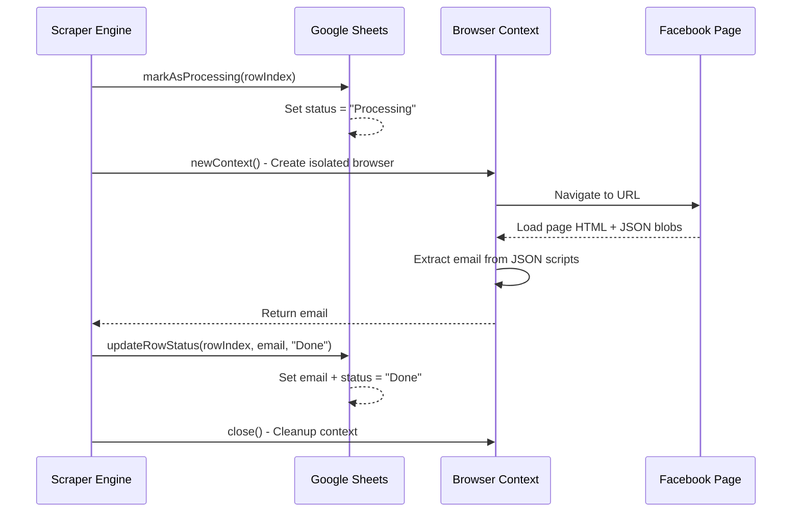

**Code Path:**
1. **scraper.js:106** → `processRow(sheetId, row, rowIndex, url)`
2. **sheets.js:91** → `markAsProcessing()` - Set status to "Processing"
3. **scraper.js:115** → `processUrl(url)` - Main scraping logic
4. **scraper.js:168** → `browser.newContext()` - Create isolated context
5. **scraper.js:209** → `page.goto(url)` - Navigate to Facebook
6. **scraper.js:225** → `page.evaluate()` - Extract email from page
7. **scraper.js:327** → Return extracted email
8. **scraper.js:122** → `updateRowStatus()` - Save results
9. **scraper.js:350** → `context.close()` - Cleanup

---

## ⚡ Parallel Processing Deep Dive

### How 5 URLs Process Concurrently

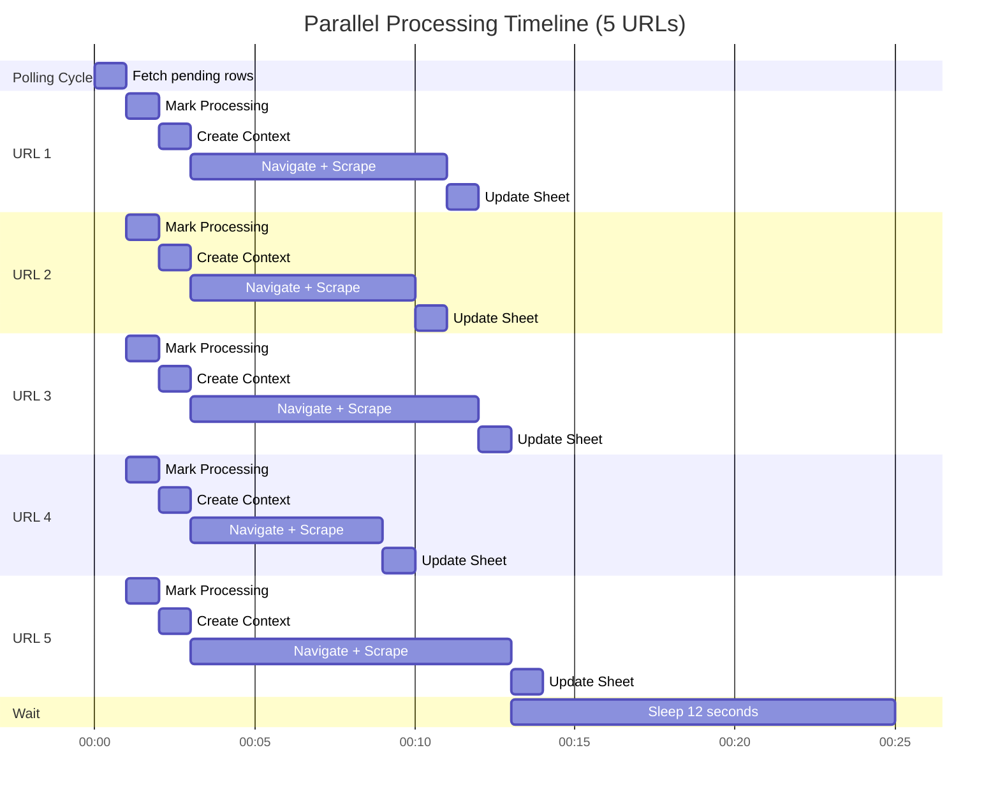

### Key Points:
- ✅ **Single Browser** - One persistent browser instance (launched once)
- ✅ **Multiple Contexts** - 5 isolated browser contexts (like incognito tabs)
- ✅ **Promise.allSettled** - All URLs process simultaneously, failures don't block others
- ✅ **Independent Timelines** - Each URL takes different time (6-10 seconds)
- ✅ **Total Time** - ~13 seconds for 5 URLs (vs ~45 seconds sequential)

### Code Implementation

**scraper.js:83-85:**
```javascript
await Promise.allSettled(
    batch.map(({ row, index, url }) => this.processRow(sheetId, row, index, url))
);
```

**What this does:**
1. Takes first 5 pending rows
2. Creates 5 promises (one per row)
3. Executes all 5 simultaneously
4. Waits for ALL to complete (even if some fail)
5. Each promise:
   - Creates its own browser context
   - Scrapes independently
   - Updates Google Sheet
   - Closes its context

---

## 📊 Data Flow Through the System

### Google Sheet Structure

```
Row 1 (Headers):
┌─────────────────────────┬──────────────────┬──────────┐
│ url                     │ email            │ status   │
├─────────────────────────┼──────────────────┼──────────┤
│ facebook.com/business1  │                  │          │ ← Pending
│ facebook.com/business2  │                  │ Processing│ ← In Progress
│ facebook.com/business3  │ contact@biz.com  │ Done     │ ← Completed
│ facebook.com/business4  │ Not found        │ Done     │ ← No Email
│ facebook.com/business5  │                  │ Failed   │ ← Error
└─────────────────────────┴──────────────────┴──────────┘
```

### Status Transitions

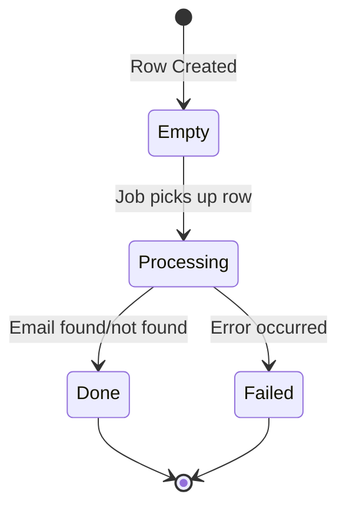

### Data Flow in Code

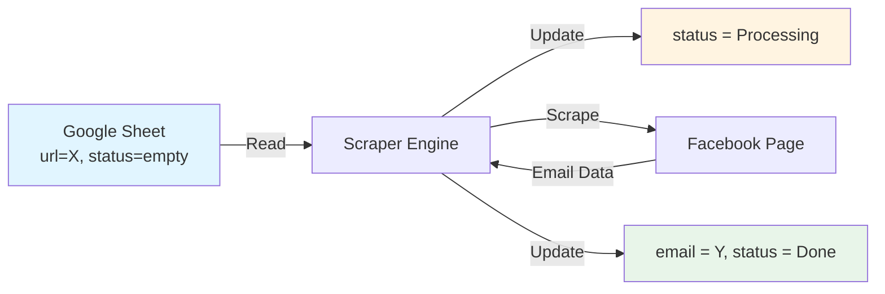

---

## 🔧 Component Interactions

### Job Manager ↔ Scraper Engine

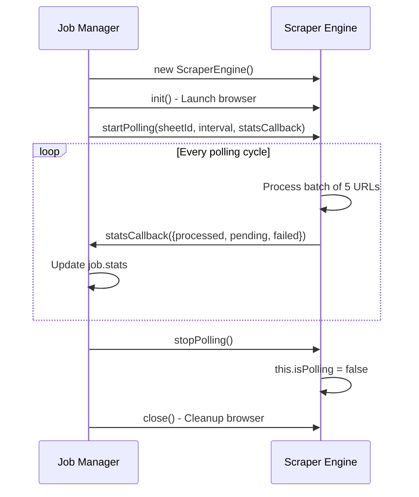

**Code Locations:**
- **jobManager.js:26** → Create ScraperEngine
- **jobManager.js:29** → `scraper.init()`
- **jobManager.js:135** → `scraper.startPolling()`
- **scraper.js:73** → `statsCallback(this.stats)` updates Job Manager
- **jobManager.js:66** → `scraper.stopPolling()`

---

### Scraper Engine ↔ Google Sheets

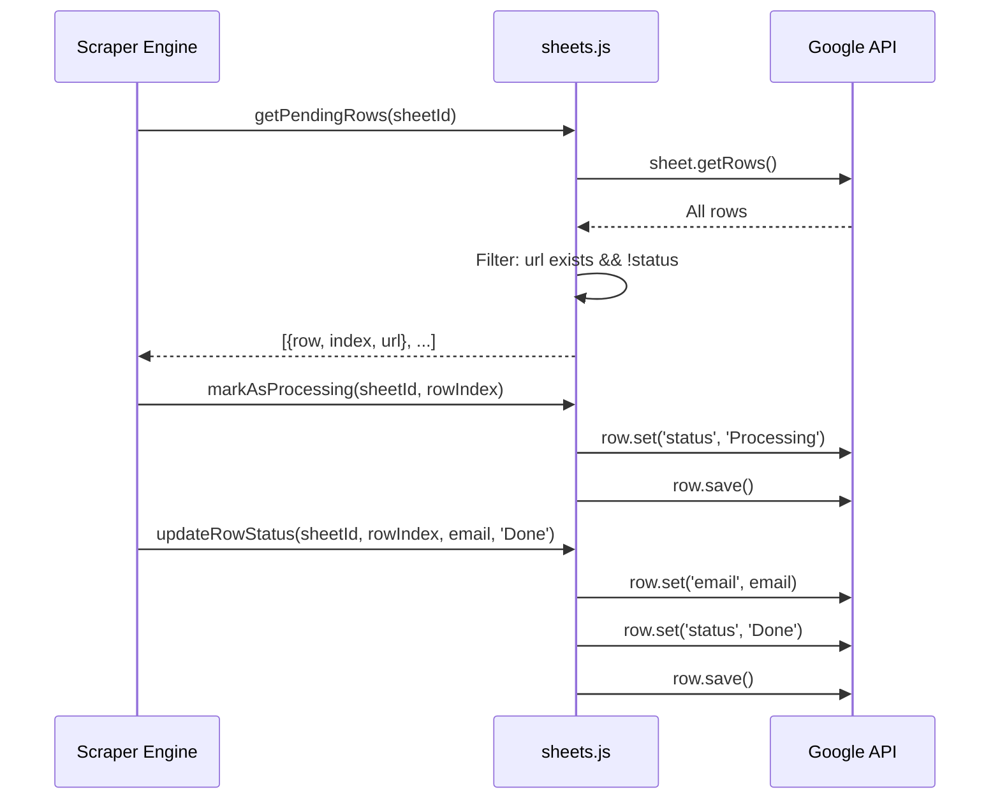

**Code Locations:**
- **scraper.js:65** → Call `getPendingRows()`
- **sheets.js:35-53** → Fetch and filter rows
- **scraper.js:112** → Call `markAsProcessing()`
- **sheets.js:91-93** → Update to "Processing"
- **scraper.js:122** → Call `updateRowStatus()`
- **sheets.js:66-82** → Update email and status

---

## 🚀 Performance Characteristics

### Throughput

| Metric | Value | Calculation |
|--------|-------|-------------|
| **Polling Interval** | 12 seconds | Configurable via `POLLING_INTERVAL_MS` |
| **Batch Size** | 5 URLs | Configurable via `PARALLEL_BATCH_SIZE` |
| **Scrape Time** | ~6-10 seconds/URL | Depends on page complexity |
| **Cycle Time** | ~13 seconds | Max(scrape_times) + overhead |
| **Throughput** | ~23 URLs/min | (60s / 13s) × 5 URLs |
| **Hourly Rate** | ~1,380 URLs/hour | 23 × 60 minutes |

### Resource Usage

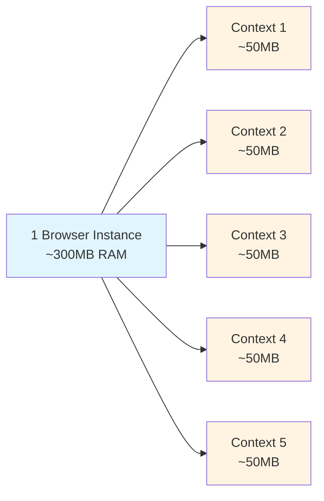

**Total RAM**: ~550MB (1 browser + 5 contexts)

---

## 🔐 Environment Configuration

```bash
# Server
PORT=3000                    # Express server port

# Polling
POLLING_INTERVAL_MS=12000    # 12s between polls
PARALLEL_BATCH_SIZE=5        # 5 URLs at once

# Google Sheets
GOOGLE_SERVICE_ACCOUNT_EMAIL # Service account email
GOOGLE_PRIVATE_KEY          # Private key for auth

# Facebook Cookies (Optional)
FACEBOOK_COOKIES=[]         # Empty = no auth (public pages)
# FACEBOOK_COOKIES=[...]    # Uncomment for authenticated scraping
```

---

## 🎯 Key Design Decisions

### 1. Why Persistent Browser?
- ✅ **Performance**: Launch once, reuse (~5s saved per batch)
- ✅ **Resource Efficient**: Shared browser process
- ✅ **Cookie Management**: Centralized session handling

### 2. Why Isolated Contexts?
- ✅ **Privacy**: Each URL gets clean state (like incognito)
- ✅ **Parallel Safe**: No cookie/cache contamination
- ✅ **Error Isolation**: One page crash doesn't affect others

### 3. Why Promise.allSettled?
- ✅ **Resilience**: Failures don't block others
- ✅ **Transparency**: See all results (success + failures)
- ✅ **Simplicity**: Built-in error handling

### 4. Why In-Memory Job Management?
- ✅ **Simplicity**: No database needed
- ✅ **Speed**: Instant state access
- ✅ **Sufficient**: Single Railway instance handles 1000s of URLs
- ⚠️ **Limitation**: Jobs lost on restart (acceptable for this use case)

### 5. Why Status Flag Pattern?
- ✅ **Simple**: Google Sheet is both input AND state database
- ✅ **Visible**: Users can see progress in real-time
- ✅ **Resumable**: Can restart without re-processing completed rows
- ✅ **No External DB**: One less service to manage

---

## 📈 Scalability Path

### Current (Phase 1) - Single Node
- **Capacity**: ~1,380 URLs/hour
- **Architecture**: In-memory job management
- **Best for**: Up to 10k URLs/day

### Future (Phase 2) - Distributed
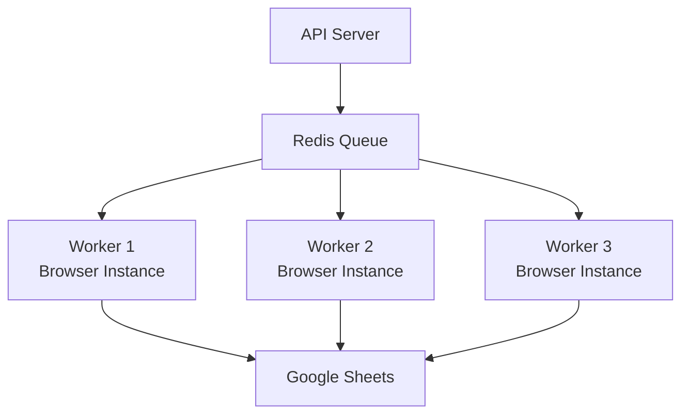

- **Capacity**: ~8,000+ URLs/hour (3 workers)
- **Architecture**: Redis + Multiple workers
- **Best for**: 100k+ URLs/day

---

## 🐛 Error Handling Flow

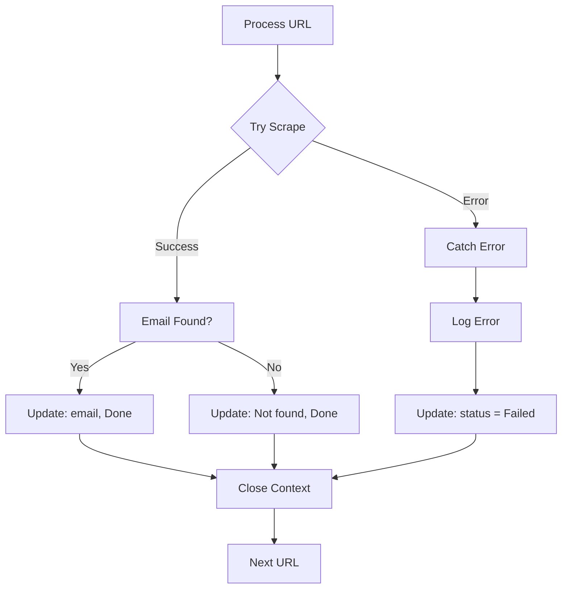

**Code Path:**
- **scraper.js:108** → `try { ... }`
- **scraper.js:122** → Success path
- **scraper.js:126** → `catch (error) { ... }`
- **scraper.js:128** → Update status to "Failed"

---

## 📝 Summary

### Architecture Highlights
✅ **API-Driven** - REST API to trigger jobs  
✅ **Parallel Processing** - 5 URLs concurrently  
✅ **Persistent Browser** - Launched once, reused  
✅ **Isolated Contexts** - Privacy + error isolation  
✅ **Status Flags** - Google Sheet as state database  
✅ **Resilient** - Failures don't block other URLs  
✅ **Scalable** - Can handle 1000s of URLs  

### Code Flow Summary
1. **User** → API request
2. **API** → Job Manager (create job)
3. **Job Manager** → Scraper Engine (start polling)
4. **Scraper** → Google Sheets (get pending rows)
5. **Scraper** → Process 5 URLs in parallel
6. **Scraper** → Update Google Sheet with results
7. **Repeat** every 12 seconds

### File Hierarchy
```
src/
├── index.js          # Entry point
├── server.js         # API endpoints
├── jobManager.js     # Job orchestration
├── scraper.js        # Parallel scraping engine
├── sheets.js         # Google Sheets integration
└── utils.js          # Logging
```

That's the complete architecture! 🚀
